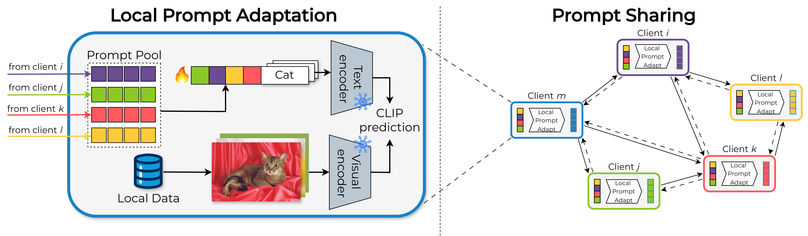

<div align="center">    



 
# Zero-DFL: Zero-shot Decentralized Federated Learning
A. Masano, M. Pennisi, F. Proietto Salanitri, C. Spampinato, G. Bellitto

</div>

# 🔍 Overview

The official PyTorch implementation for paper __"Zero-shot Decentralized Federated Learning"__. 

Zero-DFL is a fully decentralized federated learning approach for zero-shot classification, which leverage trainable soft text-prompt to adapt across distributed clients, effectively reducing communication overhead.
The proposed approach employs an iterative mechanism that adapts prompts on clients local data distribution and then share updated prompts between clients in a peer-to-peer setup. Zero-DFL achieves performance on par with or even superior to centralized approaches, also showing a 118x reduction in transmitted data compared to other methods (e.g. FedTPG). 

### 📄 Paper abstract

CLIP has revolutionized zero-shot learning by enabling task generalization without fine-tuning. While prompting techniques like CoOp and CoCoOp enhance CLIP’s adaptability, their effectiveness in Federated Learning (FL) remains an 
open challenge. Existing federated prompt learning approaches, such as FedCoOp and FedTPG, improve performance but face generalization issues, high communication costs, and reliance on a central server, limiting scalability and privacy. 
We propose Zero-shot Decentralized Federated Learning (ZeroDFL), a fully decentralized framework that enables zero-shot adaptation across distributed clients without a central coordinator. ZeroDFL employs an iterative prompt-sharing mechanism, allowing clients to optimize and exchange textual prompts to enhance generalization while drastically reducing communication overhead. We validate ZeroDFL on nine diverse image classification datasets, demonstrating that it consistently outperforms—or remains on par with—state-of-the-art federated prompt learning methods. More importantly, ZeroDFL achieves this performance in a fully decentralized setting while reducing communication overhead by 118× compared to FedTPG. These results highlight that our approach not only enhances generalization in federated zero-shot learning but also improves scalability, efficiency, and privacy preservation—paving the way for decentralized adaptation of large vision-language models in real-world applications.

### 📂 Repository details

This repo relies on the [FedTPG Framework](https://github.com/boschresearch/FedTPG) which has been modified to include the features described in the **Zero-DFL** paper.

# 💪 Training

The general command to launch a training is:

```shell
python FedTPG/Launch_FL.py --root YOUR_DATA_PATH --model_name CHOSEN_MODEL --num_cls_per_client NUM_CLASS_PER_CLIENT --train_prompt 
```

`--model_name` specifies the method. It can be `fedtpg` for  FedTPG, `coop` for a federated variant of CoOp or `vlp` for a federated variant of Vision-Language prompt learning.

`--train_prmpt` must be specified, with `coop` as model_name in order to reproduce our results.

### Prepare the data:
Please refer to [CoOP](https://github.com/KaiyangZhou/CoOp/tree/main) for data preparation.


# 📜 Citation

```bibtex
@INPROCEEDINGS{11228452,
  author={Masano, Alessio and Pennisi, Matteo and Salanitri, Federica Proietto and Spampinato, Concetto and Bellitto, Giovanni},
  booktitle={2025 International Joint Conference on Neural Networks (IJCNN)}, 
  title={Zero-shot Decentralized Federated Learning}, 
  year={2025},
  volume={},
  number={},
  pages={1-8},
  keywords={Privacy;Costs;Federated learning;Scalability;Zero shot learning;Robustness;Servers;Security;Iterative methods;Resilience},
  doi={10.1109/IJCNN64981.2025.11228452}}

```
